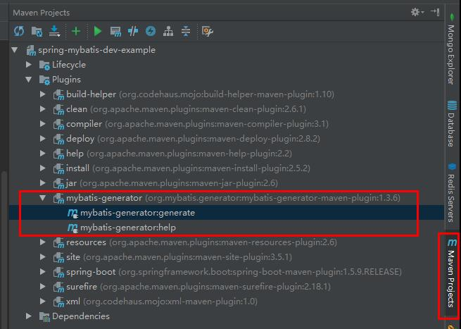
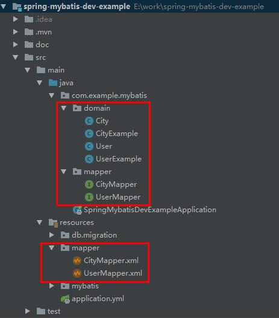

# spring-mybatis-dev-example

项目展示Spring Boot With Mybatis 的基本使用, 存在细节上的注意事项。

## 项目组件

### Flyway 数据库迁移工具

## Spring Boot with Mybatis 配置说明

### Mybatis Generator

在项目中使用了 mybatis-generator-maven-plugin 方便自动生成基础操作的DAO代码。使用时需要配置
pom.xml 以及mybatis-generator插件需要的一个生成规范的配置文件。由于使用了Mysql数据库因此在插件中
引入了Mysql依赖。pom.xml 如下:
```xml
            <plugin>
                <groupId>org.mybatis.generator</groupId>
                <artifactId>mybatis-generator-maven-plugin</artifactId>
                <version>1.4.0</version>
                <configuration>
                    <configurationFile>src/main/resources/mybatis/generator.xml
                    </configurationFile>
                    <verbose>true</verbose>
                    <overwrite>true</overwrite>
                </configuration>
                <executions>
                    <execution>
                        <id>Generate MyBatis Artifacts</id>
                        <goals>
                            <goal>generate</goal>
                        </goals>
                    </execution>
                </executions>
                <dependencies>
                    <dependency>
                        <groupId>org.mybatis.generator</groupId>
                        <artifactId>mybatis-generator-core</artifactId>
                        <version>1.4.0</version>
                    </dependency>
                    <dependency>
                        <groupId>mysql</groupId>
                        <artifactId>mysql-connector-java</artifactId>
                        <version>8.0.19</version>
                    </dependency>
                    <dependency>
                        <groupId>com.h2database</groupId>
                        <artifactId>h2</artifactId>
                        <version>1.4.200</version>
                    </dependency>
                </dependencies>
            </plugin>
```

加入插件配置应该在Maven命令中找到新的操作, idea 工具中的表现如下图：


值得详细注意的内容是resources/mybatis/generator.xml, 这个文件是mybatis-generator的配置文件详细说明了
文件该如何生成以及生成规范等。generator.xml 如下：

```xml
<generatorConfiguration>

    <context id="context" targetRuntime="MyBatis3Simple">

        <plugin type="tk.mybatis.mapper.generator.MapperPlugin">
            <property name="mappers" value="tk.mybatis.mapper.common.Mapper"/>
            <!-- caseSensitive默认false，当数据库表名区分大小写时，可以将该属性设置为true -->
            <property name="caseSensitive" value="true"/>
        </plugin>

        <commentGenerator>
            <property name="suppressAllComments" value="true"/>
            <property name="suppressDate" value="true"/>
        </commentGenerator>

        <!--数据源配置-->
        <jdbcConnection
                userId="sa"
                password="root"
                driverClass="org.h2.Driver"
                connectionURL="jdbc:h2:file:./mybatis/database;AUTO_SERVER=TRUE"/>

        <javaTypeResolver>
            <property name="forceBigDecimals" value="true"/>
        </javaTypeResolver>

        <!--Maven 执行目录是项目根目录, 因此基于项目根目录往下配置-->
        <!-- 配置ModelClass的生成地址以及一些定制需求-->
        <javaModelGenerator targetPackage="com.example.mybatis.domain" targetProject="src/main/java">
            <property name="enableSubPackages" value="false"/>
            <property name="trimStrings" value="true"/>
        </javaModelGenerator>

        <!-- 配置sql xml的生成地址-->
        <sqlMapGenerator targetPackage="mapper" targetProject="src/main/resources">
            <property name="enableSubPackages" value="false"/>
        </sqlMapGenerator>

        <!-- 配置sql xml的生成类型等-->
        <javaClientGenerator targetPackage="com.example.mybatis.mapper" type="XMLMAPPER" targetProject="src/main/java">
            <property name="enableSubPackages" value="false"/>
        </javaClientGenerator>

        <!--需要生成的表配置 schema TableName-->
        <table tableName="user"/>
        <table tableName="city"/>
    </context>
</generatorConfiguration>
```

这些配置完成之后, 通过Maven命令可以生成相关model, mapper以及绑定的sql及xml文件

异常就可以正常生成我们需要的BaseDAO Code了。

### 集成Spring Boot 

虽然按照Mybatis Generator生成了代码, 在Spring环境中必然需要直接将xxxMapper直接注入给@Service或其他@Component使用。

两种配置可以使用

1. 使用多重XML配置文件来控制逻辑
2. 使用application.yml和注释配合的方式。

第二种方式相对配置少，我们只需要给Mybatis指定我们的Mapper.xml的位置, 具体方式是在application.yml中加入配置。

```yaml
mybatis:
  mapper-locations: classpath:mapper/*.xml
```

# 其他

使用 Mybatis 代码生成器之前，需要确保数据库文件的存在，所以这之前需要启动Spring Boot，有Flyway将数据初始话。
